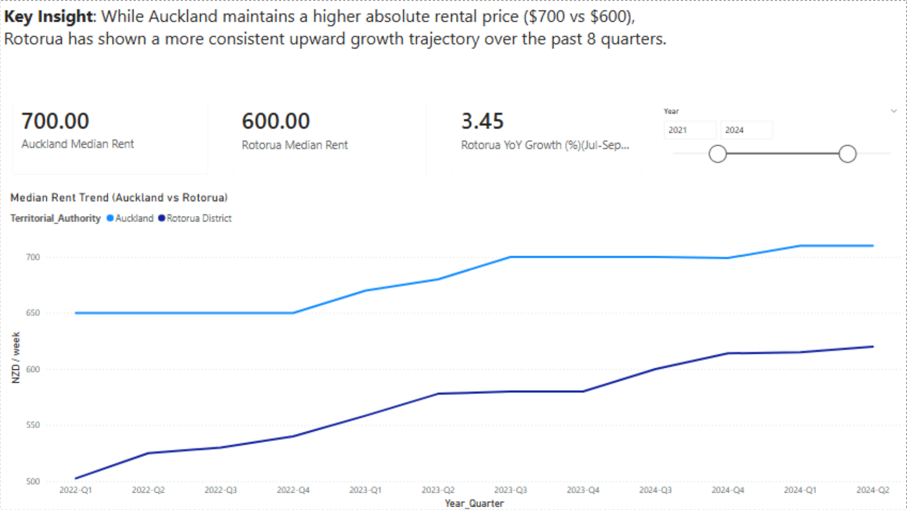
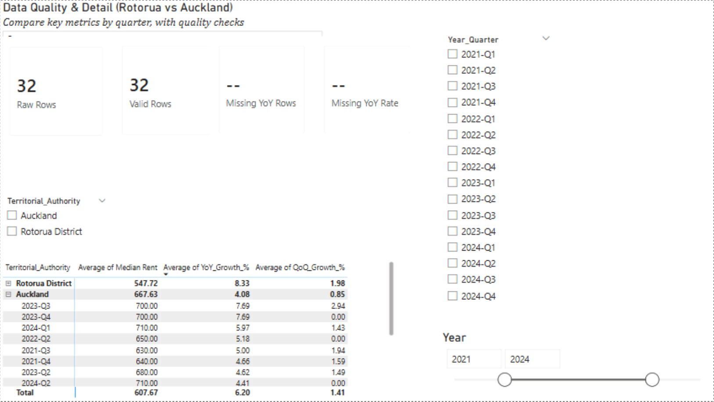

# New Zealand Rental Market Analysis (Auckland vs. Rotorua)

## 🎯 Project Objective
This project serves as a practical demonstration of data visualization and storytelling. 
It compares rental trends between Auckland and Rotorua District to help potential tenants or investors understand market shifts.

## 🛠️ Tools & Skills
* **Visualization**: Power BI Desktop (Time-intelligence DAX, Sync Slicers, Custom Tooltips)
* **Data Integrity**: Implemented a Data Quality dashboard to track missing YoY values.
* **ID Strategy**: Designed with a focus on user-centric navigation and clarity.

## 💡 Key Findings
1. **Trend Divergence**: While Auckland maintains a higher absolute rent ($700), Rotorua shows a more consistent upward trajectory.
2. **Quality Control**: Identified an 18.2% data gap in YoY metrics, addressed by filtering for matched quarterly pairs to ensure accuracy.

## 📷 Dashboard Preview

## 📂 How to View
You can download the `.pbix` file from the `/PowerBI_Files` folder to interact with the full dashboard.
